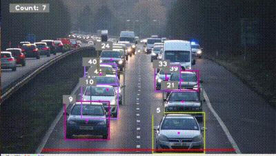

## Introduction
This project is a car counting system that utilizes YOLO (You Only Look Once) for object detection and the SORT (Simple Online and Realtime Tracking) algorithm for object tracking. The system counts the number of cars passing a specified detection line in a video feed. 



## Prerequisites
Make sure you have the required dependencies installed:

- [Ultralytics YOLO](https://github.com/ultralytics/yolov5): YOLO is used for object detection.
- [SORT (Simple Online and Realtime Tracking)](https://github.com/abewley/sort): SORT is employed for object tracking.
- [OpenCV](https://opencv.org/): Open Source Computer Vision Library.
- [cvzone](https://github.com/cvzone/cvzone): A Python library built on top of OpenCV for advanced computer vision tasks.

## Usage

1. Clone the repository:

   ```bash
   git clone https://github.com/your-username/your-repository.git
   ```

2. Navigate to the project directory:

   ```bash
   cd your-repository
   ```

3. Install the required dependencies:

   ```bash
   pip install -r requirements.txt
   ```

4. Download the YOLO weights file (e.g., `yolov8n.pt`) from the Ultralytics YOLO repository and place it in the `Yolo-weights` directory.

5. Set up the video and mask:
   - Place your video file (e.g., `cars.mp4`) in the `videos` directory.
   - Ensure you have a mask image (e.g., `mask.png`) in the `assets` directory.

6. Update the detection line coordinates:
   - Open the script (`car_counting_system.py`) and locate the `detectionLine` variable.
   - Adjust the coordinates of the detection line to match your desired position in the video.

7. Run the script:

   ```bash
   python car_counting_system.py
   ```

   The script will process the video, perform car counting, and display the annotated video with the count.

8. Terminate the script:
   - Press 'q' to stop the script and close the video window.

## Configuration
- The YOLO model is initialized with the specified weights file (`yolov8n.pt`). You can replace it with a different YOLO weights file if needed.
- The SORT tracker is configured with parameters such as `max_age`, `min_hits`, and `iou_threshold` in the `Sort` class instantiation.
- The script uses predefined class names for object detection. You can customize the `classNames` list to include/exclude specific classes.

## Acknowledgments
- Ultralytics YOLO: https://github.com/ultralytics/yolov5
- SORT (Simple Online and Realtime Tracking): https://github.com/abewley/sort
- cvzone: https://github.com/cvzone/cvzone

